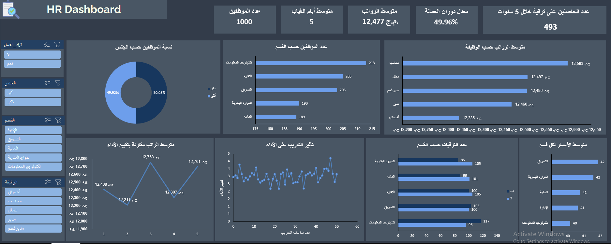

# HR Dashboard (Excel Interactive Dashboard)

## Overview
This interactive **HR Dashboard** is built using **Microsoft Excel** and provides key insights into employee data. It helps HR professionals analyze workforce trends, monitor employee performance, and make data-driven decisions effectively.

## Features
- **Employee Overview**: Total number of employees, gender distribution, and department-wise distribution.
- **Performance Analysis**: Evaluates salary distribution, absenteeism rates, and performance metrics.
- **Promotion Insights**: Tracks promotions across different departments over the last five years.
- **Training Impact**: Shows the relationship between training hours and employee performance.
- **Turnover Rate**: Displays employee retention and turnover statistics.
- **Interactive Filters**: Allows users to filter data based on department, gender, and job roles.

## Charts & Visualizations
1. **Gender Distribution Chart** – A donut chart showing the percentage of male and female employees.
2. **Employees by Department** – A bar chart displaying the number of employees in each department.
3. **Salary Distribution by Job Role** – A horizontal bar chart visualizing the average salary for different job positions.
4. **Promotion Analysis** – A stacked bar chart illustrating the number of promotions over five years across departments.
5. **Training vs Performance** – A line graph demonstrating the correlation between training hours and performance scores.
6. **Turnover Rate & Absenteeism** – Key metrics highlighting workforce stability and average days of absence.

## Key Insights
- The **gender ratio** is almost equal, with 50.08% male and 49.92% female employees.
- The **highest number of employees** are in the **Technology and Administration** departments.
- The **average salary** varies across different job roles, with **Accountants** receiving the highest pay.
- **Training significantly impacts** performance, as seen in the correlation between training hours and performance ratings.
- The **marketing and HR departments** have the **highest promotion rates**.
- The **turnover rate** is relatively high at **49.96%**, indicating potential retention challenges.

## Screenshot

## Contribution
Feel free to fork the repository and suggest improvements!

